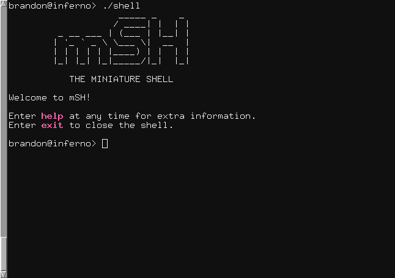

# msh - A Unix Shell

msh is a small shell for use on Unix and Unix-like systems.

msh currently does not require any special requirements. It can be
built with only the gcc compiler and GNU make.

msh currently supports command input, I/O redirection, and pipelining.

Future improvements may include:

* Command history
* Scripting support
* Network pipes

## Building

To build the code, just run

`make`

This will generate an executable named `shell`.